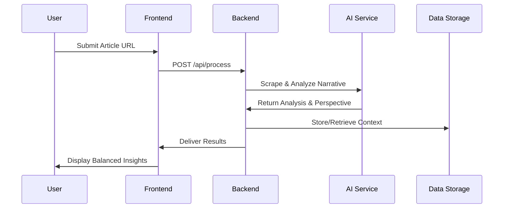
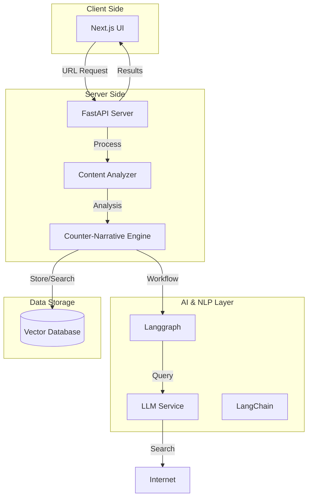

# Perspective-AI


## Table of Contents
- [Perspective-AI](#perspective-ai)
- [System Overview](#system-overview)
- [Quick Start](#quick-start)
- [Prerequisites](#prerequisites)
- [Architecture & Responsibilities](#architecture--responsibilities)
- [Core Features](#core-features)
- [Data Flow & Security](#data-flow--security)
- [Setup & Deployment](#setup--deployment)
- [Architecture Diagram](#architecture-diagram)
- [Expected Outcomes](#expected-outcomes)
- [Required Skills](#required-skills)

---

## System Overview

Perspective-AI is designed to combat the echo chambers created by personalized content algorithms. It actively curates counterarguments and alternative narratives from credible sources alongside the content you usually see. Whether it’s a news article, blog post, or social media update, Perspective-AI analyzes the existing narrative and presents a balanced, in-depth counter-perspective. This approach not only challenges your current viewpoints but also helps broaden your understanding of complex issues—all in real time.

### High-Level Concept
Imagine having a smart, opinionated friend who isn’t afraid to challenge your beliefs with well-articulated counterpoints—that’s Perspective-AI in a nutshell!

---

## Quick Start

Experience Perspective-AI locally in three major steps:
1. **Clone the repository**: `git clone https://github.com/AOSSIE-Org/Perspective.git`
2. **Setup the Backend**: Install dependencies with `uv` and configure your API keys.
3. **Setup the Frontend**: Install dependencies with `npm` and point it to the backend API.

See [Setup & Deployment](#setup--deployment) for detailed steps.

---

## Prerequisites

Before you begin, ensure you have the following installed:
- **Node.js** (v18 or higher) & **npm**
- **Python** (v3.13 or higher)
- **uv** (Modern Python package manager): [Installation Guide](https://docs.astral.sh/uv/getting-started/installation/)
- **Git**

---

## Architecture & Responsibilities

The project is split into two primary components to ensure modularity and scalability:

### Frontend (Next.js)
The [frontend](frontend/) serves as the user interface layer. It is responsible for:
- User interactions and URL submissions.
- Rendering biased article analysis and counter-perspectives.
- Managing real-time UI updates and smooth transitions.
- *For more details, see the [Frontend README](frontend/README.md).*

### Backend (FastAPI)
The [backend](backend/) serves as the intelligence layer. It is responsible for:
- **Article Scraping**: Extracting text and metadata from provided URLs.
- **Narrative Analysis**: Quantifying bias and identifying core narratives.
- **AI Processing**: Orchestrating LangGraph workflows to generate counter-perspectives.
- **Vector Search**: Managing semantic retrieval and RAG (Retrieval-Augmented Generation).
- *For more details, see the [Backend README](backend/README.md).*

---

## Architecture Components

### 1. Frontend Layer
- **Next.js UI**: A sleek, responsive interface that displays content alongside counter perspectives.

### 2. Core Backend
- **FastAPI Server**: A high-performance API server handling requests, content analysis, and response delivery.
- **Content Analyzer**: Processes incoming articles or posts to identify the dominant narrative.
- **Counter-Narrative Engine**: Uses advanced AI and NLP techniques to generate alternative perspectives and reasoned analyses.

### 3. AI & NLP Integration
- **LLM Service**: Leverages large language models (via Groq, OpenAI, etc.) to generate detailed counterarguments.
- **LangChain & Langgraph**: Frameworks to manage chains of reasoning and workflow orchestration.

### 4. Data Storage
- **VectorDB (Pinecone)**: A vector database for storing and retrieving semantic embeddings efficiently.

---

## Technical Stack

### Frontend
- **Framework**: Next.js (App Router)
- **Styling**: TailwindCSS / Lucide React

### Backend
- **Framework**: FastAPI
- **Language**: Python 3.13+
- **Orchestration**: LangGraph, LangChain
- **Environment**: Managed by **uv**

### AI Integration
- **LLMs**: Groq (Llama/Gemma models)
- **Embeddings**: Sentence-Transformers
- **Search**: Google Custom Search

---

## Core Features

### 1. Counter-Perspective Generation
Instantly identifies the main narrative of a URL and generates a balanced alternative viewpoint backed by reasoned analysis.

### 2. Reasoned Thinking
Uses logic-driven AI workflows to break down narratives into connected arguments, providing transparency in how perspectives are formed.

### 3. Real-Time Fact Check
Integrates live search and news data to ensure that counter-narratives are grounded in the latest available information.

### 4. Semantic Discovery
Leverages vector databases to find related perspectives and historical context for any given topic.

---

## Data Flow & Security



---

## Setup & Deployment

> [!IMPORTANT]
> This project requires external API keys (Groq & Pinecone) to function. Please ensure you have these ready.

### 1. Environment Configuration
Both the frontend and backend require environment files. You will find `.env.example` templates in each directory.
- **Frontend**: Create `frontend/.env` and set `NEXT_PUBLIC_API_URL`.
- **Backend**: Create `backend/.env` and provide your `GROQ_API_KEY`, `PINECONE_API_KEY`, and `PINECONE_INDEX_NAME`.

### 2. Backend Setup
```bash
cd backend
uv sync
uv run main.py
```
*The backend will be available at `http://localhost:8000` (or the port specified in `.env`).*

### 3. Frontend Setup
```bash
cd frontend
npm install
npm run dev
```
*The UI will be available at `http://localhost:3000`.*

---

## Architecture Diagram



---

## Expected Outcomes
- **Reduced Narrative Bias**: Breaking out of echo chambers through automated alternative viewpoints.
- **Enhanced Critical Thinking**: Providing users with the tools to see multiple sides of a single story.
- **Informed Discourse**: Facilitating better discussions based on a holistic understanding of complex issues.

---

## Required Skills
- **Frontend**: Next.js, TypeScript, TailwindCSS.
- **Backend**: Python, FastAPI, Pydantic.
- **AI**: LangChain, LangGraph, Vector Databases (Pinecone).
- **Tooling**: uv, Git, npm.
